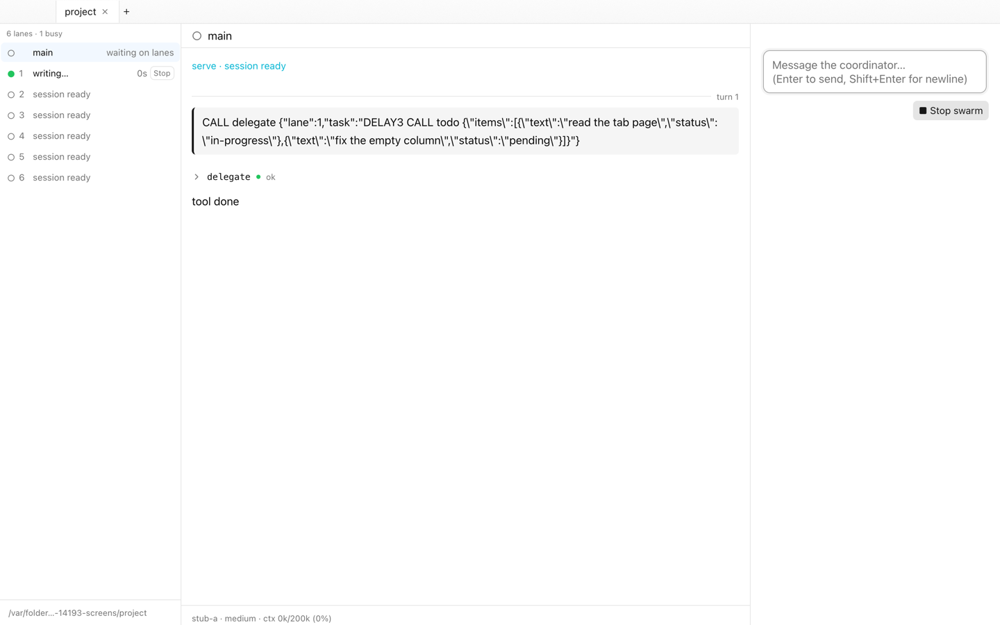

<div align="center">
  
  <h1>Evo Desktop</h1>
  <p>A native macOS app for running <b>evo</b> agent swarms:<br>
  a coordinator and its worker lanes, one tab per project.</p>
</div>

<p align="center"><picture>
  <source media="(prefers-color-scheme: dark)" srcset="docs/screens/02-lanes-working-dark.png">
  
</picture></p>

One coordinator agent plans and delegates; a pool of worker lanes does the work in parallel.
Evo Desktop is the window onto that swarm — a tab strip in the title bar, one tab per folder.

## Features

- **One tab per project.** Each tab is its own swarm in its own folder, and tabs you are
  not looking at keep working.
- **The whole swarm in one view.** The left column lists every lane — what it is on, and
  whether it is idle, working, or down — and clicking one shows that agent's transcript.
- **A live transcript.** Assistant text reads as Markdown while it streams: headings,
  tables, highlighted code, TeX math. Tool calls expand onto their arguments and results.
- **Choosers, not config files.** Pick the model, the effort and the lane count for a
  launch on the spot; evo's own catalog fills the menus, and evo checks what would not run.
- **Resume anything.** The history list shows every swarm evo can resume, newest first —
  one click opens it again in the folder it ran in.
- **Settings in the app.** **⌘,** sets your evo binaries and the theme; a Settings tab edits
  evo's own files — `init.lisp`, `swarm.lisp`, memory and lore — globally or per project.

<p align="center"><picture>
  <source media="(prefers-color-scheme: dark)" srcset="docs/screens/06-report-dark.png">
  
</picture></p>

## Requirements

- macOS 15 or newer.
- The evo binaries — `/usr/local/bin/evo-swarm` and `/usr/local/bin/evo-agent` by default.
  Point the app somewhere else under **Settings… (⌘,)**.
- Rust 1.89 or newer to build (the `store` crate uses `File::try_lock`).

## Build

```sh
cargo run -p evo-desktop    # one window, debug build
scripts/bundle.sh           # → "dist/Evo Desktop.app"
```

No API key handy? `scripts/stub_home.sh` runs the app against a scripted model in a throwaway
`HOME`, touching nothing in your real `~/.evo`.

## More

- [`docs/usage.md`](docs/usage.md) — driving it: tabs and shortcuts, the transcript,
  history, Settings, failures.
- [`docs/architecture.md`](docs/architecture.md) — which crate owns what.
- [`docs/screens.md`](docs/screens.md) — every captured state, in both themes.
- Third-party notices for the bundled fonts and math typesetting: [`assets/licenses/`](assets/licenses/).
