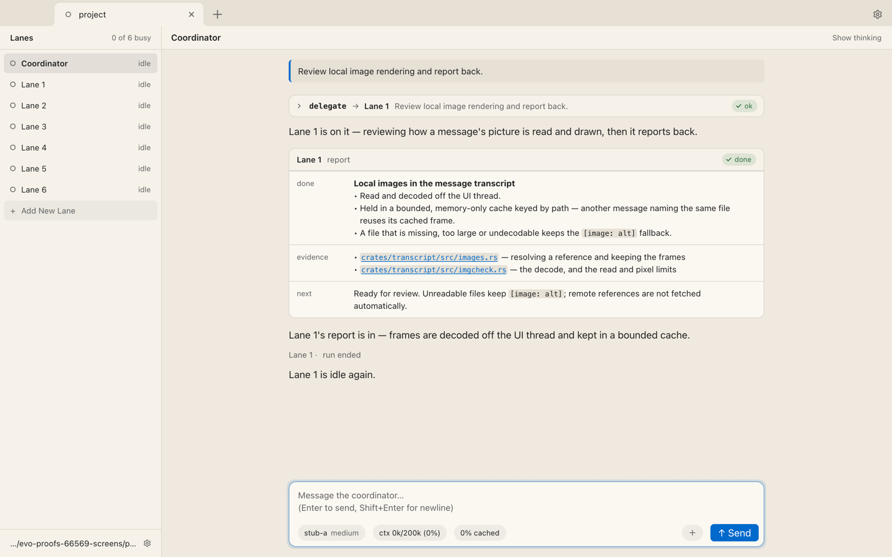

<div align="center">
  
  <h1>Evo Desktop</h1>
  <p>A native macOS app for <b>evo</b>:<br>
  run a swarm or a single agent, one tab per project.</p>
</div>

<p align="center">
  
</p>

Follow parallel work from delegation to the lane's report, or work with a single agent.
Each project has its own tab, conversation and session.

## Features

- **Project tabs.** Run a swarm or a single agent in each folder. Background tabs keep working.
- **Live lane controls.** See each worker's task and status, open its transcript, stop it,
  or grow the pool without restarting the swarm.
- **Readable transcripts.** Streaming Markdown, highlighted code, TeX math and local images.
  Expand tool calls to inspect their arguments and results; read lane reports alongside them.
- **Launch choosers.** Pick models, effort and worker count from evo's own catalog,
  with checks before launch.
- **Session history.** Resume a swarm or single-agent session in the folder where it ran.
- **Settings in the app.** Choose binaries and theme with **⌘,**. Edit evo's config,
  memory and lore globally or per project in a Settings tab.

## Requirements

- macOS 15 or newer.
- The evo binaries — `/usr/local/bin/evo-swarm` and `/usr/local/bin/evo-agent` by default.
  Point the app somewhere else under **Settings… (⌘,)**.
- Rust 1.89 or newer to build (the `store` crate uses `File::try_lock`).

## Build

```sh
cargo run -p evo-desktop    # one window, debug build
scripts/bundle.sh           # → "dist/Evo Desktop.app"
```

No API key handy? `scripts/stub_home.sh` runs the app against a scripted model in a throwaway
`HOME`, touching nothing in your real `~/.evo`.

## More

- [`docs/usage.md`](docs/usage.md) — driving it: tabs and shortcuts, the transcript,
  history, Settings, failures.
- [`docs/architecture.md`](docs/architecture.md) — which crate owns what.
- [`docs/screens.md`](docs/screens.md) — the screenshot gallery and how to capture it.
- Third-party notices for the bundled fonts and math typesetting: [`assets/licenses/`](assets/licenses/).
